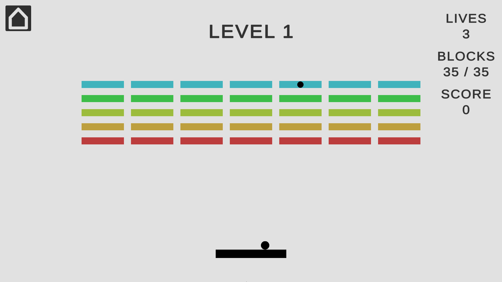
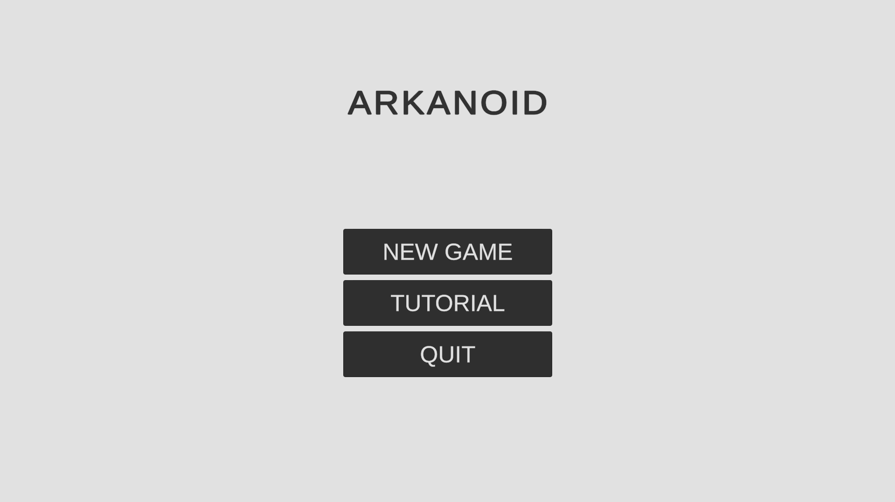
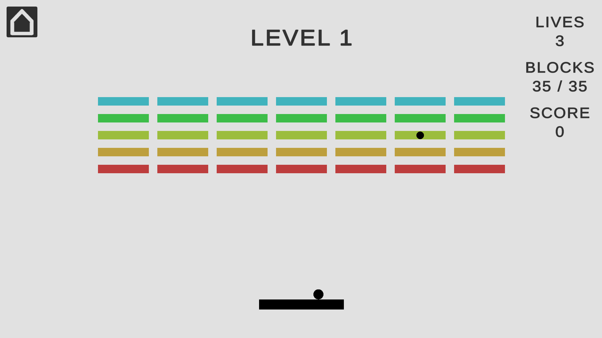
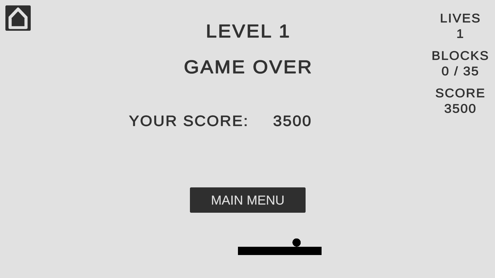

# Arkanoid

Arkanoid is a classic arcade game where the player controls a paddle to bounce a ball.

The goal of the game is to destroy all the blocks on the level while preventing the ball from falling out of bounds.

This demo has only 1 level and some screens, such as main menu:

game screen:

and game over screen:

